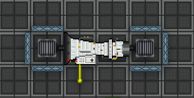
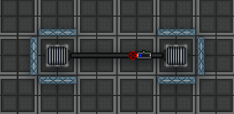

# power from nothing useing a turbine

first of all. let me make this clear this does not make a lot of power. BUT it does not need power to start and works anyware even in space.
only makes around 39.9 kW.

1. make a turbine, you need a 4 tile area free for this.
2. put passive vents on both sides of the turbine faceing inwords.
3. put a pipe and a passive gate or passive pump depending on the code base. have the passive gate send gas from the turbine output to the turbine input.
4. wall off the tiles contaning the pasive vents.
5. turn on the turbine and the passive pump.

pipeing

